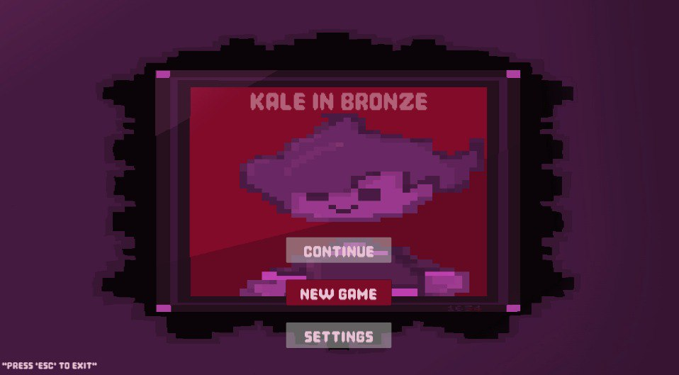

# Kale In Bronze




## Table of Contents
- [About the Game](#about-the-game)
- [Features](#features)
- [Installation](#installation)
- [How to Play](#how-to-play)
- [Contributing](#contributing)
- [License](#license)
- [Acknowledgments](#Acknowledgments)
- [Contact](#Contact)

## About the Game

Step into the chilling world of a Unity adventure game as Aron, who takes on a dare to explore an abandoned mansion shrouded in mystery. The atmosphere is unsettling, and the creaks of the floorboards hint at lurking secrets.

As you navigate this eerie mansion, you encounter the ghost of a child seeking your help to break his curse. His sorrow and determination propel you forward, intertwining your fates. There’s no turning back; you must delve into the mansion’s dark past and confront supernatural forces.

With each step, the mansion reveals sinister layers, flickering lights, portraits with watching eyes, and twisted echoes of laughter. It’s time to solve dark riddles and face the guardians of its secrets. Will you guide Aron to free the child and uncover the truth, or succumb to the haunting whispers? The choice is yours.

## Features
- 🌟 **Rich Storyline**: An engaging plot with twists and emotional depth.  
- 🧩 **Challenging Puzzles**: Solve intricate puzzles to uncover hidden secrets of the mansion.
- 🎨 **Pixel Art Style**: Enjoy a retro-inspired pixel art style, complete with handcrafted animations and atmospheric lighting.
  
## Installation
1. Clone this repository:  
   ```bash
   git clone https://github.com/Eman288/Kale-In-Bronze.git
   ```
2. Open the project in Unity 2019 or later.  
3. Run the game from Unity Editor:  
   - Open the `Assets/Scenes/MainScene.unity` file.  
   - Click the **Play** button in the Unity Editor.
     
Alternatively, download the desktop version here: [Kale-In-Bronze](https://emma288.itch.io/kale-in-bronze)

## How to Play
- **Controls**:  
  - Move: `Arrow Keys` / `WASD`  
  - Interact: `E`  
  - Jump: `Space`  
  - Exit: `Esc`  
- **Objective**:  
  Explore the mansion, solve puzzles, and uncover the secrets of the Bronze Realm.  
- **Note!!**:  
  - This early version (0.0) is a work in progress. The core gameplay mechanics, like movement and jumping, will be added in upcoming releases.

## License
This project is licensed under the **MIT License**. See the [LICENSE](LICENSE) file for details.

## Acknowledgments
- Unity Documentation: [Unity Docs](https://docs.unity3d.com/)
- Programming and Coding by **[Eman288](https://github.com/Eman288)**.
- Inspiration and artwork by **[Eman288](https://github.com/Eman288)**.  
- Special thanks to all playtesters and supporters!

### Contact
For questions or feedback, feel free to reach out to [Eman288](https://github.com/Eman288) 
or on my Linkedin: [Eman Tamam](https://www.linkedin.com/in/eman-tamam-47a2a9241/)
